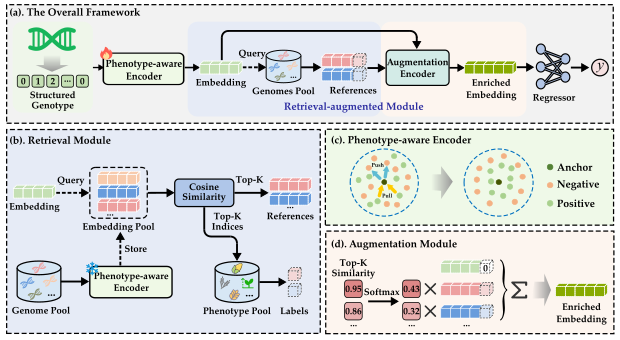

# RAGP: A Retrieval-Augmented Deep Learning Model for Genomic Prediction in Crop Breeding

## 1. Introduction

This is the code for the paper: **"RAGP: A retrieval-augmented deep learning model for genomic prediction in crop breeding"**. RAGP introduces a retrieval-augmented mechanism to enhance genomic prediction by incorporating references from genetically similar individuals. This method significantly improves performance, especially under small sample sizes and complex population structures.



---

## 2. Dataset

### 2.1 example dataset
The following datasets are supported:

* **wheat599**
* **wheat2000** and **maize8652**: Download from Baidu Cloud:
  Link: `https://pan.baidu.com/s/1qorIcAyx6tOJSBSjMP8hLA`
  Extraction Code: `0720`

Please place the datasets in the folders expected by the configuration files.

For example, the `maize8652` dataset is organized as:

```text
example-data/
└── maize8652/
    ├── X.pkl
    └── SNP_pca/
        ├── DTT.csv
        ├── PH.csv
        └── EW.csv
```

with the corresponding configuration (paths are written relative to files in `RAGP/config/`):

```json
"data_path": "../example-data/maize8652/X.pkl",
"y_files": [
  "../example-data/maize8652/SNP_pca/DTT.csv",
  "../example-data/maize8652/SNP_pca/PH.csv",
  "../example-data/maize8652/SNP_pca/EW.csv"
]
```

### 2.2 new dataset
To run RAGP on a new dataset, please organize the data in the same way:

* store the genotype feature matrix in a single file, such as `X.pkl`
* store phenotype files in the same dataset folder or a subfolder
* ensure that all phenotype files follow the same sample order as the genotype matrix

A typical structure for a new dataset is:

```text
example-data/
└── your_dataset/
    ├── X.pkl
    └── phenotypes/
        ├── trait1.csv
        ├── trait2.csv
        └── trait3.csv
```

and the corresponding configuration should be written as (paths are written relative to files in `RAGP/config/`):

```json
{
  "dataset": "your_dataset",
  "data_path": "../example-data/your_dataset/X.pkl",
  "y_files": [
    "../example-data/your_dataset/phenotypes/trait1.csv",
    "../example-data/your_dataset/phenotypes/trait2.csv",
    "../example-data/your_dataset/phenotypes/trait3.csv"
  ]
}
```


---

## 3. Requirements

Install the following Python packages with specified versions:

```bash
torch==1.13.1
torchvision==0.14.1
numpy==1.26.0
tqdm
scipy
scikit-image
scikit-learn
pandas
```

Recommended Python version: `>=3.7`

---

## 4. Running RAGP

All configuration files are located in the `RAGP/config/` folder.

To run the model on the `wheat599` dataset, use the following command:

```bash
python RAGP/run.py --config ./config/config_wheat599.json
```

To run RAGP on a different dataset, simply prepare the data in the same format, create the corresponding configuration file, and replace the config path in the command.
The model will train and evaluate, and the resulting model weights for each task will be saved in: `RAGP/ckpt/`

---

## 5. Generating Retrieval References

To generate the reference individuals used during testing, run:

```bash
python RAGP/references.py
```

The generated references will be saved in:
`RAGP/references/`


---

## 6. Running GBLUP

Runnable example scripts for the GBLUP baseline are provided for the datasets used in this study:

```bash
python gblup_wheat599.py
python gblup_wheat2000.py
python gblup_maize8652.py
```

For a new dataset, replace the genotype and phenotype file paths in the script with your own data files, and update the trait names if needed. Please ensure that the genotype matrix and phenotype files are aligned in the same sample order.

---

For questions or issues, feel free to open an issue or contact the authors.
